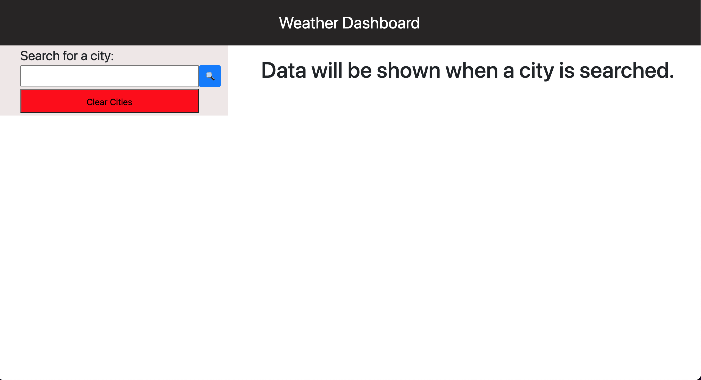
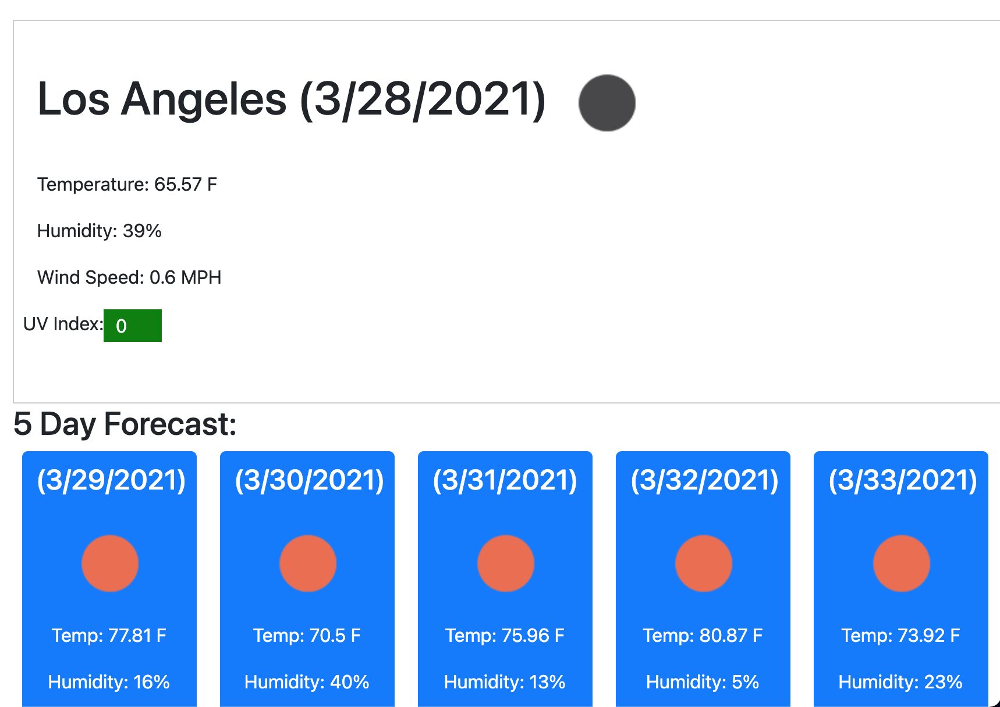
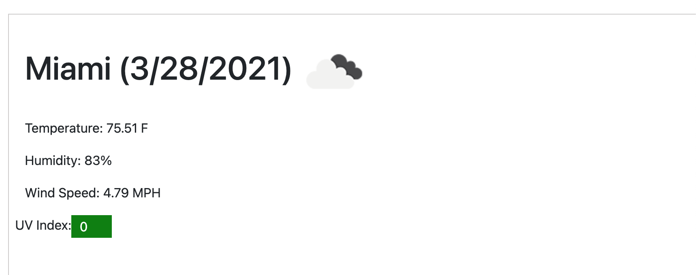
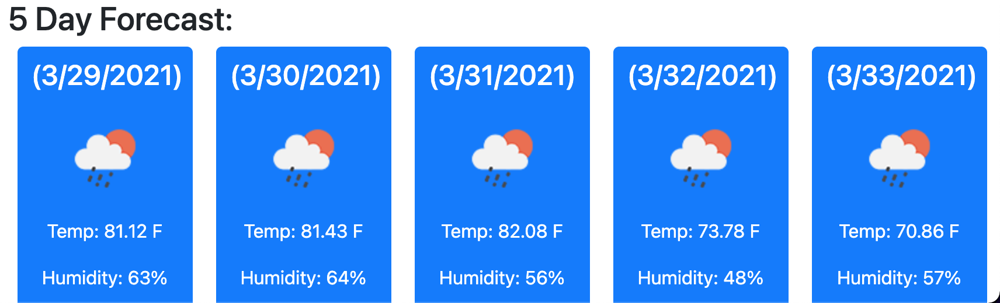
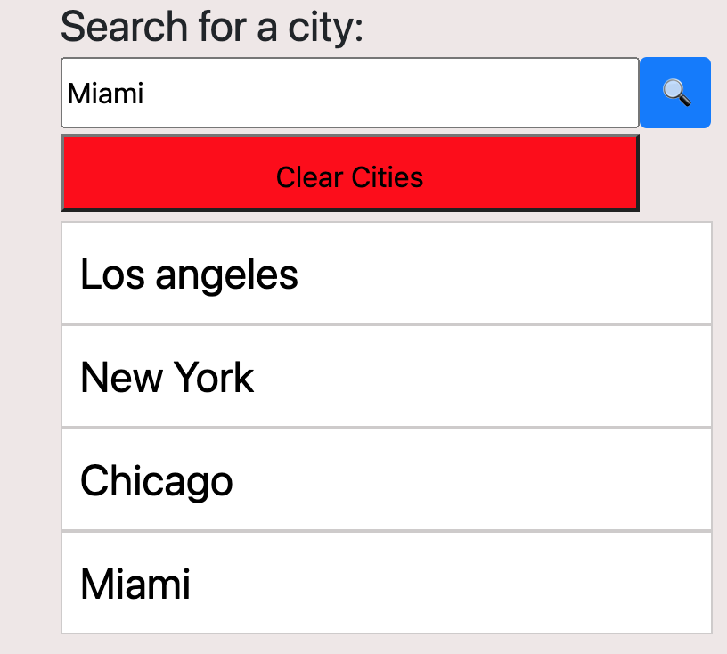

# Work Day Scheduler Starter Code

 Deployed URL : https://adambedingfield.github.io/weather-dashboard/   
 
 Github Repo URL : https://github.com/adambedingfield/weather-dashboard

 # About
Weather Dashboard is a 6 day forecast that displays the weather of a user input city.

Layout
The layout includes the cities the users searched on the left and their respective weather on the right.

# Features
The right side displays the weather of the current day with the next 5 days after below.

Current Weather displays temperature, humidity, wind speed, and the UV which is color coded to notify the user of safe/dangerous levels.

5 Day forecast plans out the upcoming weather with information on the temperature and humidity.

The left side holds where the user can input a city to be displayed. Searched cities are then displayed under the clear cities button. Clicking the clear cities button will clear the local storage of the user and any cities displayed below.

# Languages used
HTML, CSS, and Javascript.  